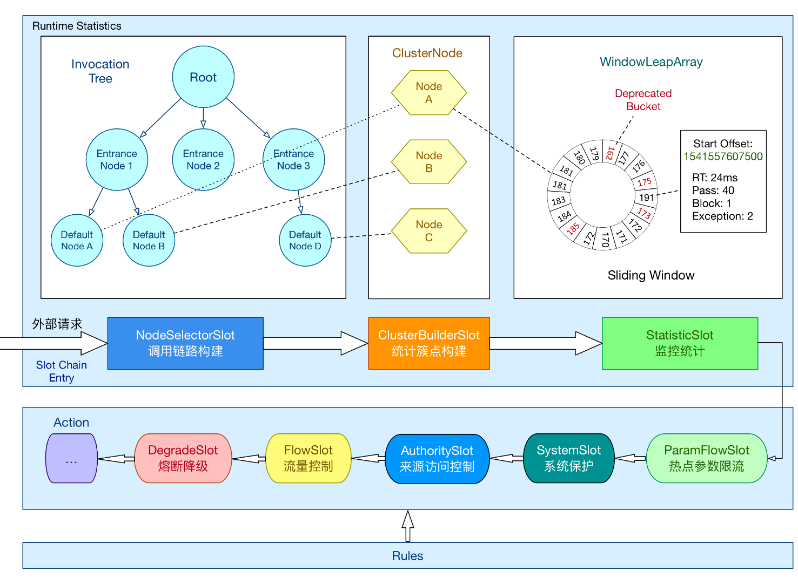
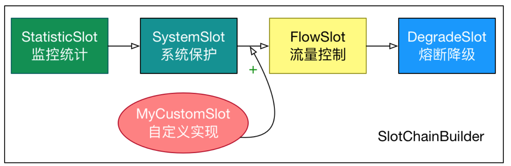
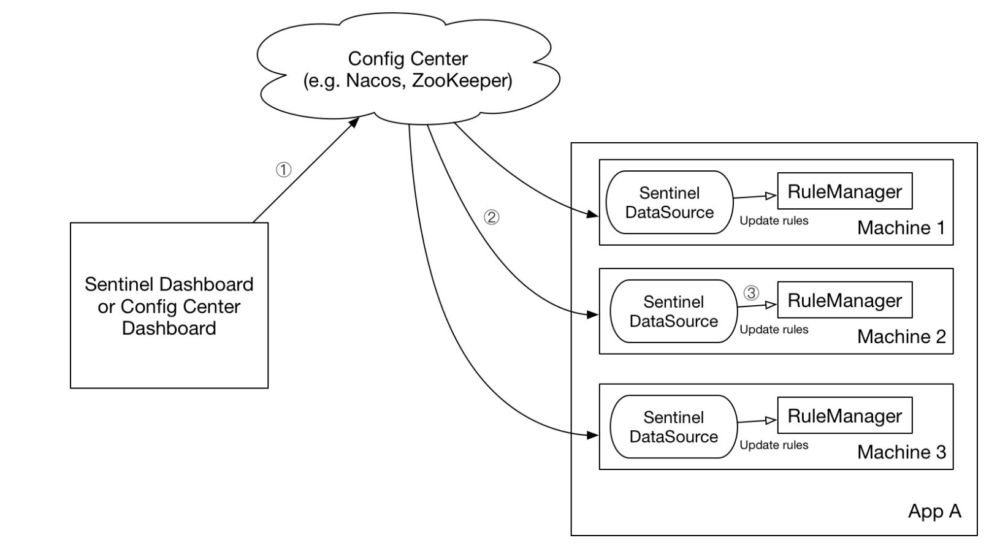

# sentinel-demo

This is a demo project for Sentinel.

## 基本原理

在 Sentinel 里面，所有的资源都对应一个资源名称以及一个 Entry。Entry 可以通过对主流框架的适配自动创建，也可以通过注解的方式或调用 API 显式创建；每一个 Entry 创建的时候，同时也会创建一系列功能插槽（slot
chain）。这些插槽有不同的职责，例如:

NodeSelectorSlot 负责收集资源的路径，并将这些资源的调用路径，以树状结构存储起来，用于根据调用路径来限流降级； ClusterBuilderSlot 则用于存储资源的统计信息以及调用者信息，例如该资源的 RT, QPS,
thread count 等等，这些信息将用作为多维度限流，降级的依据； StatisticSlot 则用于记录、统计不同纬度的 runtime 指标监控信息； FlowSlot 则用于根据预设的限流规则以及前面 slot
统计的状态，来进行流量控制； AuthoritySlot 则根据配置的黑白名单和调用来源信息，来做黑白名单控制； DegradeSlot 则通过统计信息以及预设的规则，来做熔断降级； SystemSlot 则通过系统的状态，例如 load1
等，来控制总的入口流量；

#### solt的拓展能力

Sentinel 将 ProcessorSlot 作为 SPI 接口进行扩展（1.7.2 版本以前 SlotChainBuilder 作为 SPI），使得 Slot Chain 具备了扩展的能力。您可以自行加入自定义的 slot 并编排
slot 间的顺序，从而可以给 Sentinel 添加自定义的功能

如代码中的 OwnerFLowSlot 注意 如果是自定义的，原来的FlowSolt也还是会执行。

#### sentinel的接入方式

1. 抛出异常的方式定义资源

        // 资源名可使用任意有业务语义的字符串，比如方法名、接口名或其它可唯一标识的字符串。
       try (Entry entry = SphU.entry("resourceName")) {
       // 被保护的业务逻辑
       // do something here...
        } catch (BlockException ex) {
       // 资源访问阻止，被限流或被降级
        // 在此处进行相应的处理操作
        }

2. 各大框架的适配

参考官方文档https://sentinelguard.io/zh-cn/docs/open-source-framework-integrations.html

源代码 sentinel-adapter

3. 注解的方式定义资源
   
Sentinel 支持通过 @SentinelResource 注解定义资源并配置 blockHandler 和 fallback 函数来进行限流之后的处理

注意 blockHandler 函数会在原方法被限流/降级/系统保护的时候调用，而 fallback 函数会针对所有类型的异常

4.规则的加载

Sentinel 的理念是开发者只需要关注资源的定义，当资源定义成功后可以动态增加各种流控降级规则。Sentinel 提供两种方式修改规则：

通过 API 直接修改 (loadRules)

通过 DataSource 适配不同数据源修改

### DataSource扩展

我们推荐通过控制台设置规则后将规则推送到统一的规则中心，客户端实现 ReadableDataSource 接口端监听规则中心实时获取变更，流程如下：

DataSource 扩展常见的实现方式有:

拉模式：客户端主动向某个规则管理中心定期轮询拉取规则，这个规则中心可以是 RDBMS、文件，甚至是 VCS 等。这样做的方式是简单，缺点是无法及时获取变更；

推模式：规则中心统一推送，客户端通过注册监听器的方式时刻监听变化，比如使用 Nacos、Zookeeper 等配置中心。这种方式有更好的实时性和一致性保证。

####拉模式扩展

实现拉模式的数据源最简单的方式是继承 AutoRefreshDataSource 抽象类，然后实现 readSource() 方法，在该方法里从指定数据源读取字符串格式的配置数据。比如 基于文件的数据源。

####推模式扩展
实现推模式的数据源最简单的方式是继承 AbstractDataSource 抽象类，在其构造方法中添加监听器，并实现 readSource() 从指定数据源读取字符串格式的配置数据。比如 基于 Nacos 的数据源

###注册数据源
通常需要调用以下方法将数据源注册至指定的规则管理器中：

      ReadableDataSource<String, List<FlowRule>> flowRuleDataSource = new NacosDataSource<>(remoteAddress, groupId, dataId, parser);
      FlowRuleManager.register2Property(flowRuleDataSource.getProperty());

若不希望手动注册数据源，可以借助 Sentinel 的 InitFunc SPI 扩展接口。只需要实现自己的 InitFunc 接口，在 init 方法中编写注册数据源的逻辑。比如：
package com.test.init;

public class DataSourceInitFunc implements InitFunc {

    @Override
    public void init() throws Exception {
        final String remoteAddress = "localhost";
        final String groupId = "Sentinel:Demo";
        final String dataId = "com.alibaba.csp.sentinel.demo.flow.rule";

        ReadableDataSource<String, List<FlowRule>> flowRuleDataSource = new NacosDataSource<>(remoteAddress, groupId, dataId,
            source -> JSON.parseObject(source, new TypeReference<List<FlowRule>>() {}));
        FlowRuleManager.register2Property(flowRuleDataSource.getProperty());
     }
    }

接着将对应的类名添加到位于资源目录（通常是 resource 目录）下的 META-INF/services 目录下的 com.alibaba.csp.sentinel.init.InitFunc 文件中，比如：

com.test.init.DataSourceInitFunc

